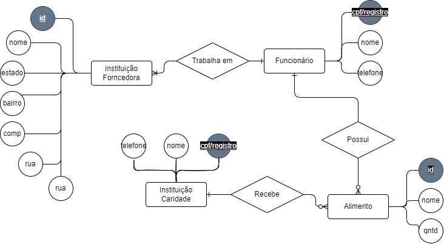

# API Projeto Redução de Desperdício

## Descrição do Projeto

O projeto visa facilitar a doação de alimentos que não seriam vendidos, por feirantes ou mercados, porém que ainda estejam em boas condições para instituições de caridade. Através de um aplicativo, o feirante ou mercado pode cadastrar os alimentos que não seriam vendidos e a instituição de caridade pode visualizar os alimentos disponíveis para doação e solicitar a retirada dos mesmos.

---

## Tecnologias Utilizadas

- [Django Rest Framework](https://www.django-rest-framework.org/)
- [PostgreSQL](https://www.postgresql.org/)

---

## Como rodar a aplicação

### Pré-requisitos

- [Python](https://www.python.org/downloads/)
- [Pip](https://pypi.org/project/pip/)
- [venv](https://docs.python.org/3/library/venv.html)

### Instalação

1. Clone o repositório

   ```sh
   git clone
    ```

2. Crie um ambiente virtual

    ```sh
    python -m venv venv
    ```

3. Ative o ambiente virtual

    ```sh
    source venv/bin/activate
    ```

4. Instale as dependências

    ```sh
    pip install -r requirements.txt
    ```

---

## Padrões de commits 📜

Repositório de referência: **[iuricode/padroes-de-commits](https://github.com/iuricode/padroes-de-commits)**

De acordo com a documentação do **[Conventional Commits](https://www.conventionalcommits.org/pt-br)**, commits semânticos são uma convenção simples para ser utilizada nas mensagens de commit. Essa convenção define um conjunto de regras para criar um histórico de commit explícito, o que facilita a criação de ferramentas automatizadas.

Esses commits auxiliarão você e sua equipe a entenderem de forma facilitada quais alterações foram realizadas no trecho de código que foi commitado.

Essa identificação ocorre por meio de uma palavra e emoji que identifica se aquele commit realizado se trata de uma alteração de código, atualização de pacotes, documentação, alteração de visual, teste...

### Tipo e descrição

O commit semântico possui os elementos estruturais abaixo (tipos), que informam a intenção do seu commit ao utilizador(a) de seu código.

- `feat`- Commits do tipo feat indicam que seu trecho de código está incluindo um **novo recurso** (se relaciona com o MINOR do versionamento semântico).

- `fix` - Commits do tipo fix indicam que seu trecho de código commitado está **solucionando um problema** (bug fix), (se relaciona com o PATCH do versionamento semântico).

- `docs` - Commits do tipo docs indicam que houveram **mudanças na documentação**, como por exemplo no Readme do seu repositório. (Não inclui alterações em código).

- `test` - Commits do tipo test são utilizados quando são realizadas **alterações em testes**, seja criando, alterando ou excluindo testes unitários. (Não inclui alterações em código)

- `build` - Commits do tipo build são utilizados quando são realizadas modificações em **arquivos de build e dependências**.

- `perf` - Commits do tipo perf servem para identificar quaisquer alterações de código que estejam relacionadas a **performance**.

- `style` - Commits do tipo style indicam que houveram alterações referentes a **formatações de código**, semicolons, trailing spaces, lint... (Não inclui alterações em código).

- `refactor` - Commits do tipo refactor referem-se a mudanças devido a **refatorações que não alterem sua funcionalidade**, como por exemplo, uma alteração no formato como é processada determinada parte da tela, mas que manteve a mesma funcionalidade, ou melhorias de performance devido a um code review.

- `chore` - Commits do tipo chore indicam **atualizações de tarefas** de build, configurações de administrador, pacotes... como por exemplo adicionar um pacote no gitignore. (Não inclui alterações em código)

- `ci` - Commits do tipo ci indicam mudanças relacionadas a **integração contínua** (_continuous integration_).

### Recomendações

- Adicione um título consistente com o título do conteúdo.
- Recomendamos que na primeira linha deve ter no máximo 4 palavras.
- Para descrever com detalhes, usar a descrição do commit.
- Usar um emoji no início da mensagem de commit representando sobre o commit.
- Os links precisam ser adicionados em sua forma mais autêntica, ou seja: sem encurtadores de link e links afiliados.

---

## To Do

- [ ] Conectar com o banco de dados (SQLite ou PostgreSQL)
- [ ] Criar as models (Feirante/Mercado, Instituição de Caridade, Alimento)
    - [ ] Feira/mercado
    - [ ] Feirante/funcionário
    - [ ] Alimento
    - [ ] Instituição de caridade

- [ ] Criar o CRUDs de usuários (Feirante/Mercado, Instituição de Caridade, Produtos)
    - [ ] Feira/Mercado
    - [ ] Feirante/Funcionário
    - [ ] Instituição de Caridade
    - [ ] Alimento
- [ ] Criar autenticação com criptografia da senha (MD5 + Hash ou SHA-256)
- [ ] Implementar filtros de busca
- [ ] Implementar georeferenciamento com mapa (Google Maps?!)
- [ ] Integrar um sistema de mensageria e notificações
